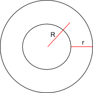

# 3D Shapes

Psh, 3D was so 2010, it's all about sniffing glue to pass the time  
## Box

> Rectangular Prism  
### Given

- Vertex -- (left, top, front)  
- Width (x), Height(y), Depth(z)  
### Defining Points

- 8 vertices
## Sphere

> Rotate a circle around x or y (not z though)  
Don't connect points. Therefore, plot things twice  
### Given  
- Center  
- Radius  
### Defining Points

- Points on circumference  
---
&theta;: Circle Creation: 0 - 2&pi;  
&phi;: Rotation: 0 - &pi;  
x = rcos&theta; + Cx  
y = rsin&theta;cos&&phi; + Cy  
z = rsin&theta;sin&phi; + Cz  
```
for rot: 0 - 1
	for circ: 0 - 1
		x = rcos(pi * circ) + Cx
		y = rsin(pi * circ)cos(2pi * rot) + Cy
		z = rsin(pi * circ)sin(2pi * rot) + Cz
```

## Torus (courtesy of Mr. Kats)

> Dounut Shape
### Given


- Center  
- Distance from center to center of cross section (R)  
- Radius of cross section (r)  
### Defining Points

- Points on the surface  
---
Torus = Circle + Translation + Rotation  
y-rotation Circle + Translation  
[cos&phi;  0 sin&phi;][rcos&phi; + r] =
[  0       1   0     ][rsin&phi;]     =
[-sin&phi; 0 cos&phi;][0]             =
