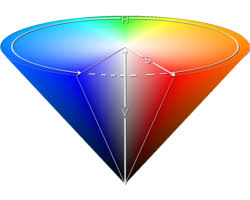

# Peering into the depths of color -- 1/28

**Color Depth**: The amount of data used to represent a single pixel

| Size   | Color Options                               | Description |
| ------ | ------------------------------------------- | ----------- |
| 1 bit  | 1 color, on | off                           |             |
| 2 bit  | 1 color with intensity                      |             |
| 3 bit  | red, green, and blue (8 colors)             |             |
| 4 bit  | red, green, blue, and intensity             |             |
| 6 bit  | red, green, blue, with individual intensity |             |
| 3 byte | R G B, each with 256 values                 |             |

## Defining Color

**RGBA**: Red, Green, Blue, Alpha (transparency) **HSB**: Hue,
Saturation (how deep color is), Brightness



## Image File Formats

Raster vs Vector  
**Vector** formats represent images as a series of drawing instructions.
(\*.svg -- Scalable Vector Graphics)  
**Raster** formats represent images as a grid of pixels (think how a tv
updates)  
  
Uncompressed vs. compressed (Raster)  
**Uncompressed images** contain data for each pixel (BMP, TIFF, RAW)  
**Compressed formats** use a compression algorithm to minimize file
size  
  
Lossless vs Lossy  
Lossless compression algorithms contain enough info to exatly recreate
the original image (PNG -- Portable Network Graphics, GIF -- Graphics
Interchage Format)  
Lossy compression algorithms do not retain all the details of the
original image (JPEG -- Joint Photographic Experts Group)  
  
**PPM (Portable PixMap)**: Uncompressed raster format (RGB triplets in
ascii or binary)

``` python
P3 (or P6 if you're writing in binary)
5 5 (pixel len and width of file)
255
255 255 0 255 255 0 255 255 0 255 255 0 255 255 0
255 255 0 255 255 0 255 255 0 255 255 0 255 255 0
255 255 0 255 255 0 255 0 255 255 255 0 255 255 0
255 255 0 255 255 0 255 255 0 255 255 0 255 255 0
255 255 0 255 255 0 255 255 0 255 255 0 255 255 0
```


`convert` is a useful tool to convert images between formats
