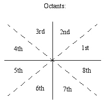

# Line Algorithm

Input: 2 pixel endpoints. Output: Line that connects two inputs  
Problem: in order for line to be accurate, it would need to be able to
draw on the subpixel level, which is impossible  
Potential Solutions: Test Potential Pixels, iterate through potential
pixels

Today's task will be to develop a line algorithm that only works in
octant I.  
Thus, we only need to turn on one pixel per x

Algorithm is basically: 1. Loop through x0 to x1 2. TEST(x + 1, y)
TEST(x + 1, y + 1) 3. Pick best point

## Formulas

y = mx + b =\> Ax + By + C = 0 A = dy, B = -dx, C = dx / b Variables
gotten by simplifying y = mx + b to Ax + By + C

f(x, y) = Ax + By + C  
(x + 1, y + .5) -- Midpoint of our options  
f(x + 1, y + .5)  
  if 0, MP on line, pick one option  
  if pos, MP is below line, pick(x + 1, y + 1)  
  if neg, MP above line, pick (x + 1, y)::

  - Part 1:  
    x = x0, y = y0 while x \<= x1 plot(x, y) d0 = f(x + 1, y + 1) d1 =
    f(x + 1, y) if abs(d0) \< abs(d1) y = y + 1 x = x + 1

  - Part 2:  
    plot(x, y) d = f(x + 1, y + .5) if d \> 0 y++
