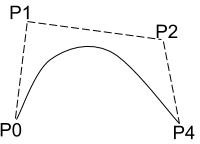
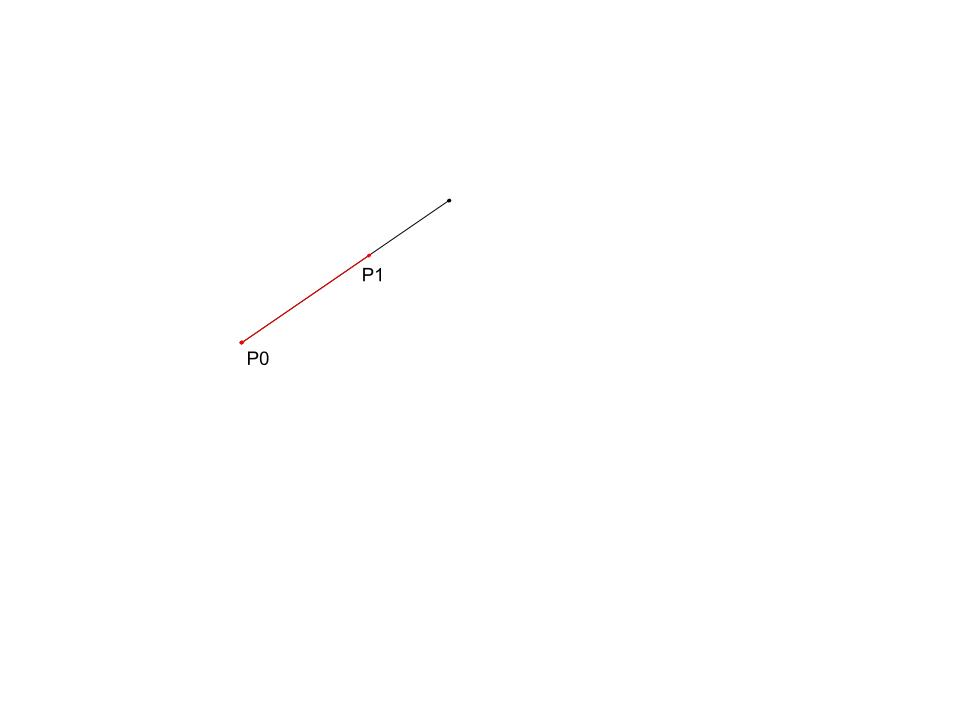

# Splines -- 3/3/2020
- Curves (cubic) that appeared to be smooth/continuous
## Bezier
Defined By: 2 Endpoints (P0, P3)  
            2 Influence Points(P1, P2)  

Influence points pull the curve  
Quadratic curve would only have on influence point  
### Line

Pt = (1 - t)P0 + tP1

### Quadratric

Q = (1 - t)Q0 + tQ1
Q0t = (1 - t)P0 + tP1
Q1t = (1 - t)P1 + tP2
Qt = (1 - t)[(1 - t)P0 + tP1] + t[(1 - t)P1 + tP2]
Qt = (1 - t)^2 * P0 + t(1 - t)P1 + t(1 - t)p1 + t^2P2

## Hermite

