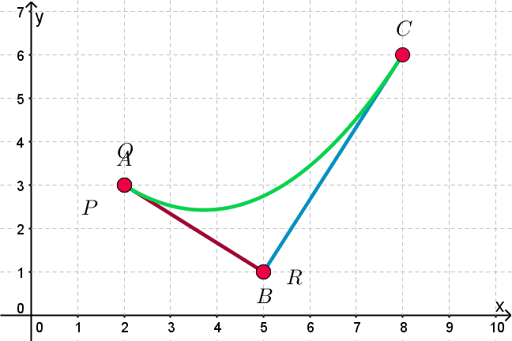
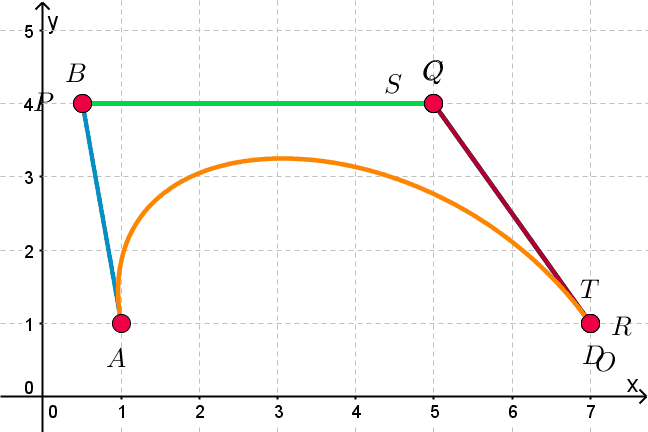

# Splines -- 3/3/2020
> Curves (cubic) that appeared to be smooth/continuous
## Bezier
Defined By: 2 Endpoints (P0, P3)  
            2 Influence Points(P1, P2)  

Influence points pull the curve  
Quadratic curve would only have on influence point  
### Line

Pt = (1 - t)P0 + tP1

### Quadratric

Q0 = (1 - t)Q0 + tQ1  
Q0t = (1 - t)P0 + tP1  
Q1t = (1 - t)P1 + tP2  
Qt = (1 - t)[(1 - t)P0 + tP1] + t[(1 - t)P1 + tP2]  
**Qt = (1 - t)2P0 + 2t(1 - t)P1 + t2P2**  

### Cubic

O = (1 - t)S + tT  
S = (1 - t)2A + 2t(1 - t)B + t2C  
T = (1 - t)2B + 2t(1 - t)C + t2D  
O = (1 - t)[(1 - t)2A + 2t(1 - t)B + t2C] + t[(1 - t)2B + 2t(1 - t)C + t2D]  
O = (1 - t)3A + 3t(1 - t)2B + 3t2(1 - t)C + t3D  
**(-A + 3B - 3C + D)t3 + (3A - 6B + 3C)t2 + (-3A + 3B)t + A**  
Form: at3 + bt2 + ct + d

## Hermite
Defined By: 2 endpoints: P0, P1  
            Rates of change at each endpoint : R0, R1  
Hermite curves are better when you're typing instructions rather than clicking and drawing things  
f(t) = at3 + bt2 + ct + d  *Points on curve*  
f'(t) = 3at2 + 2bt + c  *Rates of change*  
f(0) = d *P0*  
f(1) = a + b + c + d *P1*  
f'(0) = C *R0*  
f'(1) = 3a + 2b + c *R1*  
