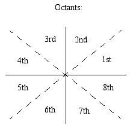

Line Algorithm
###############

| Input: 2 pixel endpoints. Output: Line that connects two inputs
| Problem: in order for line to be accurate, it would need to be able to draw on the subpixel level, which is impossible
| Potential Solutions: Test Potential Pixels, iterate through potential pixels

| Today's task will be to develop a line algorithm that only works in octant I.
| Thus, we only need to turn on one pixel per x
Algorithm is basically:
1. Loop through x0 to x1
2. TEST(x + 1, y) TEST(x + 1, y + 1)
3. Pick best point

Formulas
********

.. seealso:: y = mx + b => Ax + By + C = 0
	     A = dy, B = -dx, C = dx / b
	     Variables gotten by simplifying y = mx + b to Ax + By + C

| f(x, y) = Ax + By + C
| (x + 1, y + .5) -- Midpoint of our options
| f(x + 1, y + .5)
|   if 0, MP on line, pick one option
|   if pos, MP is below line, pick(x + 1, y + 1)
|   if neg, MP above line, pick (x + 1, y)::

Part 1:
   x = x0, y = y0
   while x <= x1
     plot(x, y)
     d0 = f(x + 1, y + 1)
     d1 = f(x + 1, y)
   if abs(d0) < abs(d1)
     y = y + 1
   x = x + 1

Part 2:
   plot(x, y)
   d = f(x + 1, y + .5)
   if d > 0
     y++
